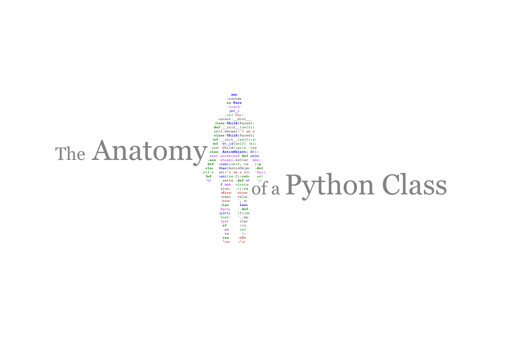
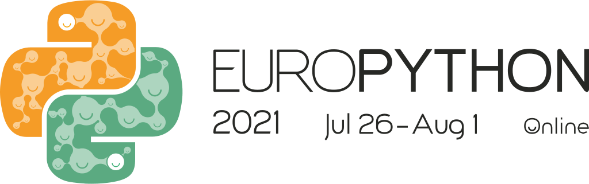

## Abstract

Classes are one of the fundamental building blocks of Python and are essential for object-oriented programming. In this tutorial we will explore how classes work and look at tips and tricks for getting the most out of them. By the end you should have, not only a much better understanding of what Python classes are, but also some new ideas for writing better code.

This first part of the tutorial presents some introductory and intermediate topics. The focus being on an intimate understanding of how classes work in Python.
- Methods
- Properties
- Operator overloading

The second part of the tutorial introduces some slightly more advanced topics.
- Inheritance
- Composition
- Abstract Classes

Some fun exercises are scattered throughout the tutorial to keep things interesting.

The tutorial is aimed as intermediate Python users but should also be accessible to beginners.

## Prerequisites
