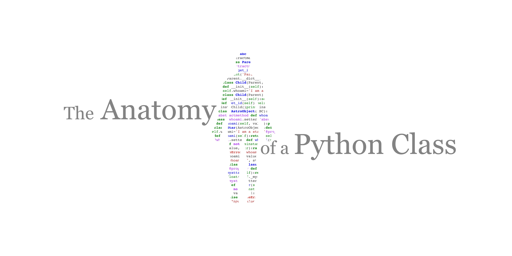

[](https://mybinder.org/v2/gh/sfarrens/The-Anatomy-of-a-Python-Class/HEAD)
[](https://colab.research.google.com/github/sfarrens/The-Anatomy-of-a-Python-Class)



<a href="http://www.cosmostat.org/" target="_blank"></a><a href="https://ep2021.europython.eu/talks/BivGxE9-the-anatomy-of-a-python-class/" target="_blank"></a>

> Author: <a href="https://sfarrens.github.io/" target="_blank" style="text-decoration:none; color: #F08080">Samuel Farrens</a>  
> Email: <a href="mailto:samuel.farrens@cea.fr" style="text-decoration:none; color: #F08080">samuel.farrens@cea.fr</a>  

## Abstract

Classes are one of the fundamental building blocks of Python and are essential for object-oriented programming. In this tutorial we will explore how classes work, and look at tips and tricks for getting the most out of them. By the end you should have, not only a much better understanding of what Python classes are, but also some new ideas for writing better code.

This first part of the tutorial presents some introductory and intermediate topics. The focus being on an intimate understanding of how classes work in Python.
- Methods
- Properties
- Operator overloading

The second part of the tutorial introduces some slightly more advanced topics.
- Inheritance
- Composition
- Abstract Classes

Some fun exercises are scattered throughout the tutorial to keep things interesting.

The tutorial is aimed as intermediate Python users but should also be accessible to beginners.

## Set Up

This tutorial consists of two [Jupyter](https://jupyter.readthedocs.io/) notebooks that only require native Python. All of the demonstrations and exercises can be followed either remotely (*i.e.* running on an online server) or locally (*i.e.* running on your computer).

### Running Remotely

Both notebooks can be run remotely using either [Binder](https://mybinder.org/v2/gh/sfarrens/The-Anatomy-of-a-Python-Class/HEAD) or [Google Colab](https://colab.research.google.com/github/sfarrens/The-Anatomy-of-a-Python-Class) without the need to install anything locally. Note, however, the performance of either of these services may depend on the quality of your internet connection.

To run the notebooks remotely simply click on the badge at the top of this document for the service you prefer to use.

> :warning: If you opt to use Binder, you may want to launch the server 5-10min before the session starts as it can take some time.
>
> If you opt to use Google Colab, the first time you execute a cell you will get a warning that says "Warning: This notebook was not authored by Google.". Click "Run anyway". Also note that some cells are collapsed by default so you need to click on sections that say "X cells hidden" to view the full content.

### Running Locally

If you prefer to run the notebooks locally you will simply need an environment where you have Python (>=v3.6) and Jupyter (v1.0.0) installed. Be sure to set this up before the session starts.

#### Cloning the Repository

To clone the repository run the following.

```bash
$ git clone https://github.com/sfarrens/The-Anatomy-of-a-Python-Class.git
$ cd The-Anatomy-of-a-Python-Class
```

> Note that here `$` refers to your system prompt.

#### Conda Environment

To avoid any unforeseen issues, I have also provided a [Conda](https://docs.conda.io/) `environment.yml` so that you can build an environment where I have tested the notebooks. To build and activate the environment simply run the following.

```bash
$ conda env create -f environment.yml
$ conda activate pyanatomy
```

#### Updating the Repository

If you choose to run things locally, please be sure to pull the latest commits to repository on the morning of the session to ensure you have the latest version of the notebooks.

If you have followed the previous steps, you only need to run the following.

```bash
$ git pull origin master
```

#### Running the Notebooks

To run the notebooks simply run the following.

```bash
$ jupyter notebook
```

This should open Jupyter in your default web browser.

## Exercise Solutions

Example solutions to the exercises can be found in the presentation versions of the notebooks located in the `presentation` directory.

Any comments or questions about these solutions can be raised in the [Discussions](https://github.com/sfarrens/The-Anatomy-of-a-Python-Class/discussions/1).
